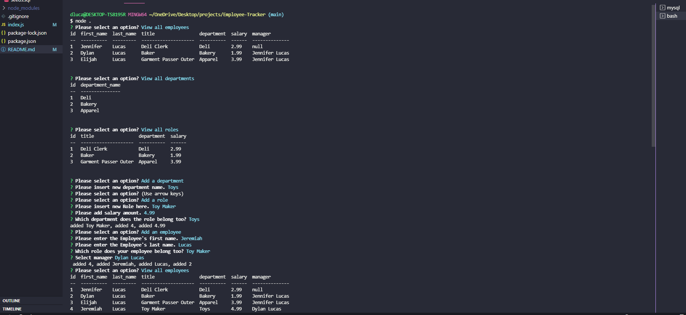

# Employee-Tracker

## Description
Employee- Tracker was created so Managers can view their, employee's, departments, and roles with the employee salaries through the terminal in an easy application. 

## Table of Contents (Optional)
* [Installation](#installation)
* [Usage](#usage)
* [License](#license)
* [Contributing](#contributing)
* [Test](#test)
* [Questions](#questions)

## Installation
Clone the repo, then do "npm install". Change your password in the connect.js file. Then open your Mysql and run "source db/schema.sql" and "source db/seeds.sql", once successful, run "quit". Then run "node index" in the terminal to start the program, and follow the prompts. 

## Usage
This is what it will look like on your device. 
[Screencastify](https://watch.screencastify.com/v/VqM77zul8X8l4X17oouz)

## License 
N/A

## Contributing
Jennifer Lucas 

## Tests 
N/A

## Questions
Please checkout my [Github](https://github.com/jenmlucas) for other projects. If you have any other questions or concerns, feel free to email me at jenmlucas1@gmail.com.

